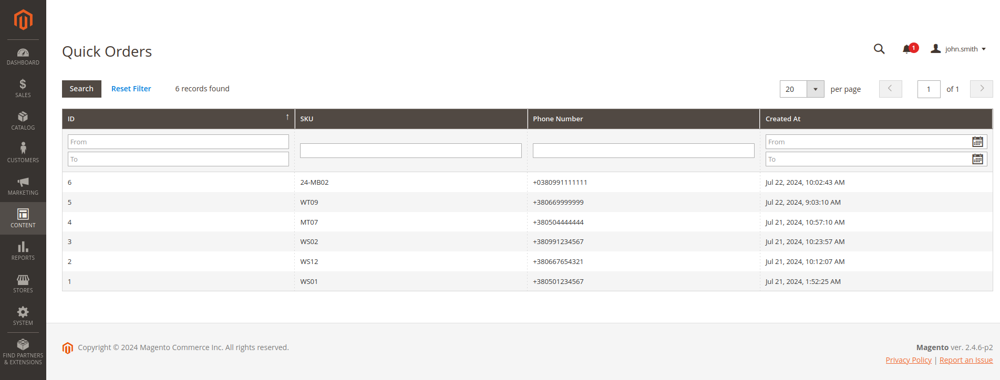

# Magento 2 Quick Order Module

## Опис

* Модуль виводить на сторінці будь якого товару кнопку "Купити в 1 клік".
* При кліку на кнопку з'являється поле вводу номера телефона і кнопка відправки.
* Після відправки, дані про номер і SKU поточного товару записуються у БД.
* Адмін може подивитись в адмінці всі замовленняу у гріді. Доступні поля: SKU товару, телефон, дата і час.


## Встановлення

1. Клонуйте сховище в папку `app/code/Andrew/QuickOrder`:

   ```
   git clone https://github.com/aarkhyptsev/magento-quick-order.git
   ```
2. Перейдіть до кореня інсталяції Magento та виконайте:
   ```
   bin/magento setup:upgrade
   bin/magento setup:di:compile
   bin/magento cache:clean
   ```
## Скріншоти

Сторінки товару з модулем:


Скріншот гріда в адмінці:
 
]()
